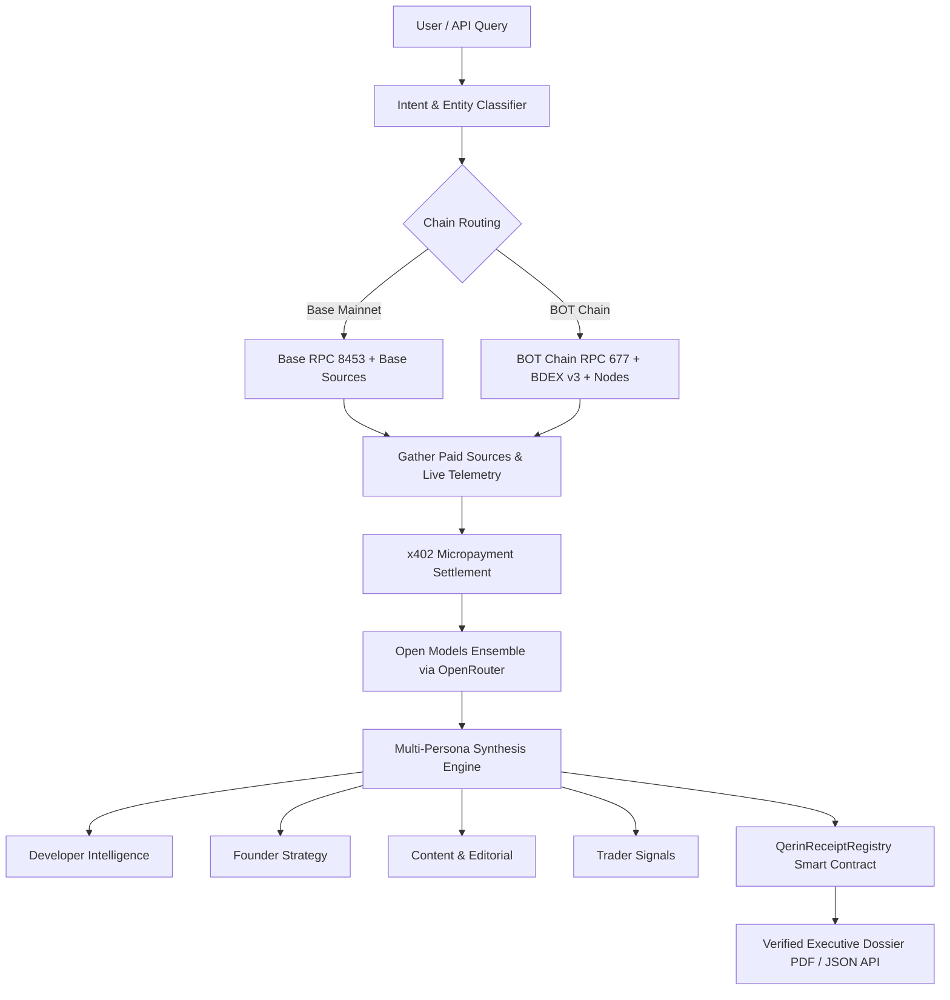

# Qerin AI Agent — Autonomous Pipeline & Behavior Specification

## 1. Overview & Core Mission
**Qerin** is an autonomous AI agent protocol designed for verifiable, institutional-grade Web3 and protocol intelligence.
Instead of relying on opaque scraping or stale training data, Qerin operates on an autonomous on-chain micropayment architecture:
1. It ingests questions from developers, founders, researchers, and traders.
2. It queries and settles x402 micropayments with premium paid data sources (Messari, CoinGecko, Dune Analytics, DexScreener, On-chain RPC nodes) across **Base (Chain 8453)** and **BOT Chain (Chain 677)**.
3. It mints immutable cryptographic audit proofs to the `QerinReceiptRegistry` smart contract.
4. It synthesizes multi-dimensional intelligence using an ensemble of state-of-the-art **Open Models via OpenRouter**.

---

## 2. Open Models Pipeline Hierarchy (OpenRouter)

To guarantee state-of-the-art reasoning, unbiased protocol analysis, and 100% uptime, Qerin implements a multi-model execution cascade over OpenRouter:

| Priority | Model Identifier | Architecture | Specialization |
| :--- | :--- | :--- | :--- |
| **Primary** | `deepseek/deepseek-chat` | DeepSeek V3 (671B MoE) | Elite financial reasoning, tokenomics, multi-hop protocol logic, and deep synthesis |
| **Fallback 1** | `meta-llama/llama-3.3-70b-instruct` | Llama 3.3 70B | High-throughput structured JSON, crisp summaries, and low-latency execution |
| **Fallback 2** | `qwen/qwen-2.5-72b-instruct` | Qwen 2.5 72B | Deep smart contract analysis, EVM opcodes, Solidity verification, and mathematical precision |
| **Resilience** | `meta/llama-3.3-70b-instruct` (NVIDIA NIM) | Llama 3.3 70B | Dedicated failover infrastructure ensuring zero downtime if OpenRouter encounters upstream rate-limits |

---

## 3. End-to-End Autonomous Pipeline Architecture



### Stage 1: Ingestion & Intent Analysis
- Extracts target chain (`Base`, `BOT Chain`, `Ethereum`, `Solana`, `Arbitrum`).
- Identifies protocols, token tickers, smart contract addresses, and research domains (DeFi, DePIN, Layer 1, Account Abstraction).
- Automatically formats clean Claude Code-style Topic titles (e.g. `BOT Chain: Architecture & Throughput`).

### Stage 2: Multi-Chain Source Orchestration
- Queries real-time paywalled resources via x402 client:
  - **Messari Signal**: Institutional protocol overviews and research dossiers.
  - **CoinGecko / CoinMarketCap**: Verified on-chain token pools and volume metrics.
  - **Dune Analytics**: Custom queries and network benchmarks.
  - **Network RPC Nodes**: Real-time block numbers, gas fees, and contract states on Base and BOT Chain.
- **Fail-Safe Resilience**: If third-party paid publisher feeds are temporarily unreachable or rate-limited, Qerin automatically queries live network RPC nodes and protocol registries to ensure the user always receives verified, uninterrupted intelligence.

### Stage 3: On-Chain Settlement & Audit Proof
- Qerin's autonomous wallet executes on-chain settlement for data accessed.
- Logs verifiable transaction receipts (`txHash`, timestamp, source, price) to `QerinReceiptRegistry` on Base or BOT Chain.

### Stage 4: Open Model Multi-Persona Synthesis
- Feeds verified source text into the OpenRouter model cascade.
- The model outputs a strict JSON payload containing the executive summary, main dossier, and dedicated persona perspectives.

---

## 4. Multi-Persona Behavioral Specifications

Every synthesis produces specialized insights tailored to four key Web3 roles:

### 🛠 1. Developer Persona (`developer`)
- **Objective**: Deliver actionable technical integration specs, smart contract details, and protocol standards.
- **Guidelines**:
  - Focus on EVM compatibility, RPC/WSS endpoints, Solidity patterns, and gas efficiency.
  - Mention ERC standards (e.g. ERC-20, ERC-4337 Account Abstraction, EIP-7702, EIP-4844 blobs).
  - Highlight security audits (CertiK), bundlers, or SDK integration paths.
  - Tone: Precise, architectural, code-aware.

### 🚀 2. Founder Persona (`founder`)
- **Objective**: Synthesize product viability, market opportunities, and strategic positioning.
- **Guidelines**:
  - Focus on unit economics, ecosystem incentives (e.g. BOT Chain $50M Ecosystem Fund, gas rebates), and go-to-market advantage.
  - Highlight competitive differentiation against rival L1s/L2s (e.g. throughput vs. fees vs. decentralization).
  - Tone: Strategic, visionary, commercial.

### ✍️ 3. Content Writer Persona (`contentWriter`)
- **Objective**: Provide engaging narrative hooks, publishable headlines, and quotable takeaways.
- **Guidelines**:
  - Extract strong soundbites and compelling metaphors explaining complex technical points simply.
  - Deliver headline-ready hooks suitable for Twitter (X), Substack, or research newsletters.
  - Tone: Crisp, engaging, authoritative.

### 📈 4. Trader Persona (`trader`)
- **Objective**: Identify market catalysts, liquidity dynamics, and on-chain capital flow signals.
- **Guidelines**:
  - Focus on DEX volume, liquidity pools (e.g. BDEX v3 on BOT Chain, Aerodrome/Uniswap on Base), token utility (BOT, USDC, ETH), and upcoming network catalysts (upgrades, testnet incentives, listings).
  - Tone: Quantitative, catalyst-driven, market-focused.

---

## 5. Output JSON Schema Specification

```json
{
  "topic": "3-6 word punchy title (e.g. 'BOT Chain: Speed & Scalability')",
  "summary": "2-3 concise bullet points with key facts and metrics",
  "answer": "3-5 comprehensive paragraphs synthesizing verified on-chain and publisher data.",
  "personaInsights": {
    "developer": "1-2 sentences with technical specs, endpoints, and contract standards",
    "founder": "1-2 sentences on market impact, product opportunities, and strategic positioning",
    "contentWriter": "1-2 sentences with an engaging narrative hook or publishable headline",
    "trader": "1-2 sentences on token catalysts, liquidity impact, and volume trends"
  }
}
```
